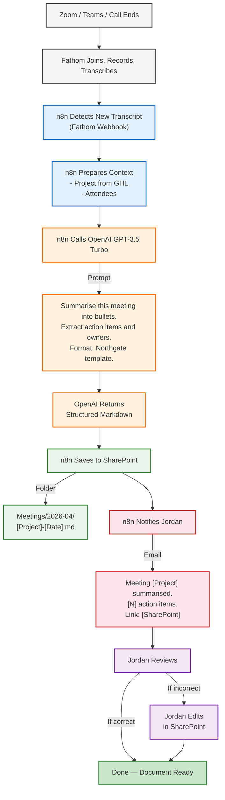
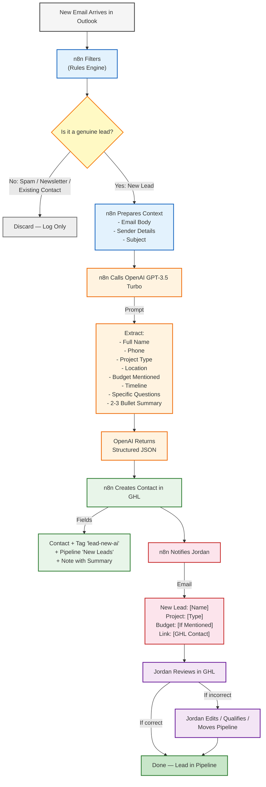
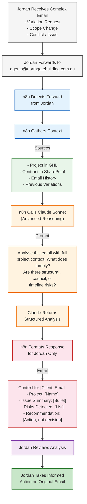
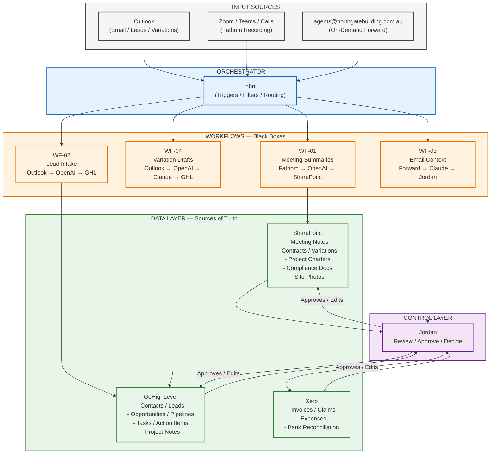
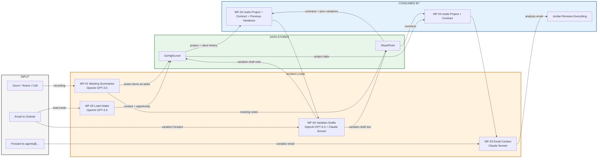
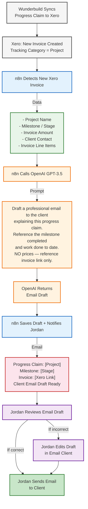
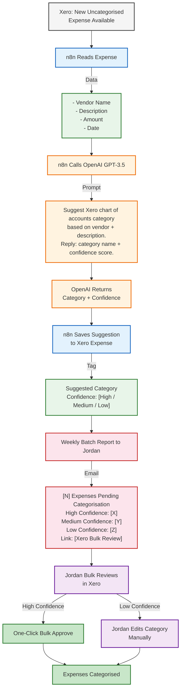
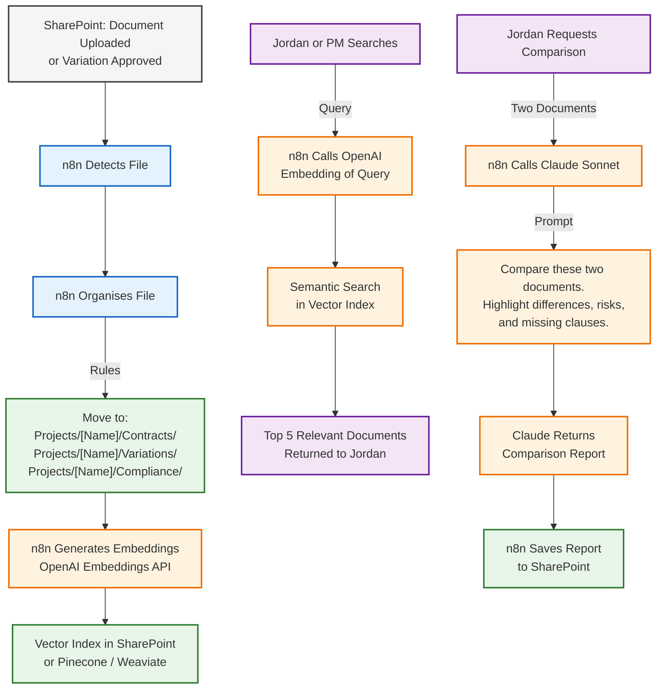
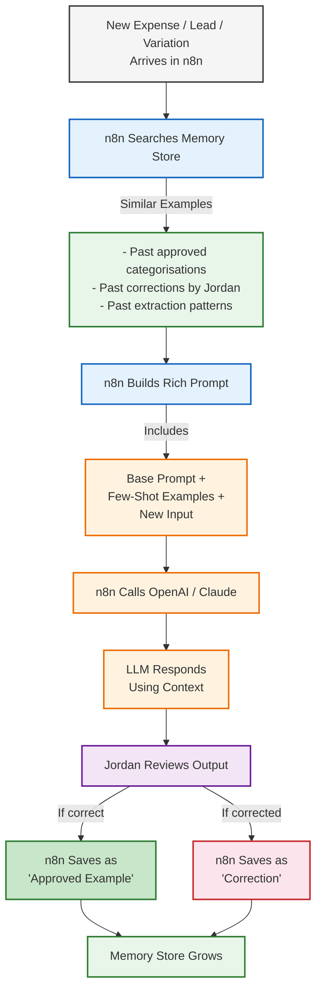

# Estrategia de Automatización de Operaciones — Northgate Building Group
## Para Jordan | Versión 2.0 — Basada en workshop del 26/04

---

## 1. Resumen Ejecutivo

> **"Empezar chico, sin riesgo, ver cómo funciona, y luego integrar paso a paso."**

Esta estrategia reemplaza la aproximación técnica pura (MCP-first) por una aproximación **pragmática y segura**: n8n como orquestador visible, **OpenAI (GPT-3.5/GPT-4)** como motor de procesamiento según complejidad, **Claude reservado solo para reasoning avanzado**, y las herramientas existentes como fuentes de verdad.

No se trata de reemplazar gente. Se trata de que Jordan pase de gestionar operaciones diarias a **recibir reportes semanales** y enfocarse en estrategia, clientes y cerrar deals.

**Horizonte:** 3-6 meses para capa base operativa. 12-18 meses para visión completa.

---

## 2. Principios Fundamentales (No Negociables)

| # | Principio | Por qué |
|---|-----------|---------|
| 1 | **Empezar sin riesgo** | El primer workflow no puede afectar leads, finanzas ni clientes. Solo resume y estructura. |
| 2 | **Layering progresivo** | Cada capa se prueba y se valida antes de agregar la siguiente. No todo junto. |
| 3 | **Jordan tiene control total** | La AI genera **borradores**. Jordan aprueba, edita o rechaza. Nunca auto-ejecuta decisiones críticas. |
| 4 | **Knowledge document vivo** | Todo workflow automatizado se documenta en un solo lugar. Cuando algo falla, el raw info está disponible. |
| 5 | **Separación trabajo / personal** | Los sistemas de AI solo tocan cuentas y datos de Northgate. Firewall absoluto con lo personal. |
| 6 | **Monitor antes de confiar** | Cada workflow corre en modo "notify Jordan" por mínimo 2 semanas antes de cualquier auto-ejecución. |
| 7 | **No tocar números finales** | Cubit es dueño de estimaciones. Xero es dueño de facturas. La AI estructura, no calcula ni aprueba. |
| 8 | **Zero friction para Jordan** | Jordan no es técnico. Todo debe funcionar sin que él tenga que "grabar a mano", "subir archivos", o "acordarse de apretar un botón". |
| 9 | **No triggers por keywords en emails sensibles** | Los workflows delicados (variations, estimaciones, claims) no escanean el inbox buscando palabras clave. Jordan **reenvía conscientemente** a direcciones dedicadas (`variations@`, `estimations@`). La AI puede **sugerir** acciones, pero nunca ejecuta sin que Jordan haya decidido primero. |

---

## 3. Visión de Largo Plazo (18 meses)

```
JORDAN — Director
    │
    ├── Reporte semanal AI (lunes 8am)
    │   ├── Resumen de leads, proyectos, finanzas
    │   ├── Action items pendientes con flags de riesgo
    │   └── Recomendaciones (no decisiones)
    │
    ├── Reporte semanal Staff (viernes 5pm)
    │   └── Update de project managers, site managers, ops
    │
    └── Jordan se enfoca en:
        ├── Estrategia y dirección
        ├── Riesgo y finanzas
        ├── Clientes y deals
        └── Asegurar que la AI no se desvíe
```

**Lo que la AI NO hará nunca (incluso en 18 meses):**
- Decidir qué lead tiene prioridad
- Aprobar variations o cambios de scope
- Modificar facturas o claims en Xero sin validación
- Decidir qué subcontratista contratar
- Enviar comunicaciones a clientes sin borrador previo

---

## 4. Arquitectura de 3 Capas (Visual)

```
┌──────────────────────────────────────────────────────────────┐
│  CAPA 3 — INTELIGENCIA (OpenAI + Claude)                     │
│  OpenAI GPT-3.5/GPT-4: procesamiento y resúmenes             │
│  Claude: reasoning avanzado, análisis de riesgos, decisions  │
│  Costo estimado: $10-30/mes                                  │
├──────────────────────────────────────────────────────────────┤
│  CAPA 2 — AUTOMATIZACIÓN (n8n)                               │
│  "Orquesta todo lo visible"                                  │
│  Triggers, condiciones, rutas, timers, notificaciones        │
│  Costo estimado: $20-50/mes                                  │
├──────────────────────────────────────────────────────────────┤
│  CAPA 1 — FUENTES DE VERDAD (Herramientas existentes)        │
│  Outlook | GoHighLevel | Xero | SharePoint | Zoom/Fathom     │
│  Nada se guarda en la AI. Todo vive aquí.                    │
└──────────────────────────────────────────────────────────────┘
```

### Regla de Oro
> **n8n ejecuta. OpenAI procesa. Claude razona cuando es complejo. Las herramientas guardan. Jordan decide.**

### Modelo por Tarea — Criterio de Uso

| Tipo de Tarea | Modelo | Ejemplo | Por qué |
|---------------|--------|---------|---------|
| **Extracción estructurada** | OpenAI GPT-3.5 / GPT-4o-mini | Extraer nombre, teléfono, budget de un email | Barato, rápido, suficiente |
| **Resumen en bullets** | OpenAI GPT-3.5 / GPT-4o-mini | Resumir un meeting transcript | Barato, suficiente |
| **Clasificación binaria** | OpenAI GPT-3.5 / GPT-4o-mini | ¿Es spam? ¿Es variation genuine? | Barato, instantáneo |
| **Análisis de riesgos complejo** | **Claude Sonnet** | Analizar un email de variation con contexto de contrato | Mejor reasoning, contexto largo |
| **Draft de variation document** | **Claude Sonnet** | Comparar scope original vs nuevo, detectar implicaciones estructurales | Mejor reasoning, precisión |
| **Comparación de documentos** | **Claude Sonnet** | Comparar contrato vs variation, flaggear diferencias | Análisis profundo |
| **Redacción de comunicación** | OpenAI GPT-3.5 / GPT-4o-mini | Draft de email al cliente explicando un progress claim | Barato, tono profesional |

---

## 5. El Stack de Jordan — Estado Actual y Conexiones

| Herramienta | Qué aporta | Cómo se conecta | Complejidad | Estado |
|-------------|-----------|-----------------|-------------|--------|
| **Outlook** | Emails de leads, cambios, aprobaciones | n8n trigger por direcciones dedicadas (`leads@`, `variations@`, `agents@`) + reenvío consciente de Jordan | **Baja** | ✅ Listo |
| **GoHighLevel** | CRM, pipelines, contactos, oportunidades | n8n node nativo GHL + webhooks | **Baja** | ✅ Listo |
| **Xero** | Facturas, gastos, claims, cobros | n8n node Xero + API | **Baja** | ✅ Listo |
| **Zoom + Fathom** | Grabaciones, transcripts de meetings | Fathom API → n8n (futuro) | **Baja-Media** | 🔧 Fathom a instalar |
| **SharePoint** | Contratos, documentos, fotos de obra | n8n node SharePoint (fase 2) | **Media** | ⏳ Después |
| **Wunderbuild** | Project management, cost planning | Sin API pública. Sync nativo a Xero. | **Alta** | ⏳ Fuera del MVP |
| **Cubit** | Estimaciones, quantity takeoff | Desktop app, sin API | **Alta** | ⏳ Fuera del MVP |

**Nota clave:** Wunderbuild y Cubit se dejan fuera del MVP. Wunderbuild synca nativamente a Xero (progress claims, purchase orders, contacts), por lo que los datos financieros fluyen indirectamente. Cubit permanece como silo hasta que tenga export automático.

---

## 6. Workflows — Orden de Implementación (Layering)

### FASE 0: Setup y Primer Workflow (Semana 1-2)
**Workflow: Meeting Summaries → SharePoint**

**Por qué primero:** Es el workflow de **menor riesgo**. Solo resume información que ya existe. No toca leads, no toca números, no envía nada a clientes.

```
[1] Zoom / Teams / Call termina
    ↓
[2] Fathom entra, graba y genera transcript
    ↓
[3] n8n detecta nuevo transcript (Fathom webhook)
    ↓
[4] n8n llama a OpenAI (GPT-3.5 Turbo): 
    "Resume este meeting en bullets. Extrae action items y owners."
    ↓
[5] OpenAI responde con estructura
    ↓
[6] n8n guarda en SharePoint (folder: Meetings/YYYY-MM/)
    ↓
[7] n8n notifica a Jordan por email:
    "Meeting [Proyecto] resumido. [N] action items. Link: [SharePoint]"
    ↓
[8] Jordan revisa. Si algo está mal, edita en SharePoint.
```

**Deliverable inmediato:** Jordan ve su primer ahorro de tiempo en menos de 1 semana.

---

### FASE 1: Lead Intake (Semana 3-4)
**Workflow: Email de lead → CRM + Resumen**

**Por qué segundo:** Ya validado que la AI resume bien. Ahora se agrega una acción (crear contacto) pero con **safeguards**.

```
[1] Prospecto envía email a leads@northgatebuilding.com.au
    (o Jordan reenvía un lead que llegó a su inbox personal)
    ↓
[2] n8n FILTRA (reglas básicas):
    - ¿No es newsletter/spam?
    - ¿Remitente no está ya en GHL?
    ↓
[3] n8n llama a OpenAI (GPT-3.5 Turbo):
    "Extrae info de este lead: nombre, proyecto, ubicación, budget, timeline."
    ↓
[4] n8n CREA contacto en GHL (tag: "lead-new-ai")
    + Nota con resumen de OpenAI
    ↓
[5] n8n NOTIFICA a Jordan:
    "Nuevo lead: [Nombre] — [Tipo proyecto] — [Budget si hay]"
    Link directo a GHL
    ↓
[6] Jordan revisa en GHL. Edita, califica, o descarta.
```

**Safeguard:** El lead nunca recibe auto-respuesta en esta fase. Jordan decide si y qué responder.

---

### FASE 2: Email Context Layer (Semana 5-6)
**Workflow: Análisis de Contexto Global — Suggest-Only**

Jordan forward-ea emails complejos a `agents@northgatebuilding.com.au`. La AI analiza el email con **contexto completo del proyecto** (historial, contratos, variations previos, finanzas) y **sugiere acciones**. Nunca ejecuta. Jordan decide qué hacer con la información.

```
[1] Jordan recibe email complejo (variations, scope changes, conflictos, cualquier cosa)
    ↓
[2] Jordan forward-a a agents@northgatebuilding.com.au
    (decisión consciente: "quiero entender la situación completa antes de actuar")
    ↓
[3] n8n detecta el forward
    ↓
[4] n8n busca contexto global:
    - Proyecto en GHL (estado, timeline, contactos)
    - Contrato original en SharePoint
    - Variations previos del mismo proyecto
    - Meeting notes de WF-01
    - Claims y pagos en Xero
    ↓
[5] n8n llama a Claude (Sonnet) — advanced reasoning:
    "Analiza este email con contexto completo del proyecto. ¿Qué implica? ¿Hay riesgos? ¿Hay dependencias con decisions previas?"
    ↓
[6] n8n responde a Jordan (solo a Jordan):
    "Contexto del email de [Cliente]:
     - Proyecto: [Nombre]
     - Issue: [Resumen]
     - Contexto histórico: [decisiones previas relacionadas]
     - Riesgos detectados: [lista]
     - Sugerencia: [forward-ear a variations@, responder directamente, o agendar meeting]"
    
    Jordan lee, entiende la situación completa, y toma su propia decisión.
```

---

### FASE 3: Variation Drafts (Semana 7-8)
**Workflow: Request de cambio → Borrador estructurado**

Similar al documento original pero con **validación obligatoria**.

```
[1] Jordan recibe email de cliente pidiendo cambio
    ↓
[2] Jordan forward-ea a variations@northgatebuilding.com.au
    (decisión consciente: "esto necesita un variation draft")
    ↓
[3] n8n busca proyecto en GHL + scope original en SharePoint
    ↓
[4] n8n llama a Claude (Sonnet) — advanced reasoning: Genera borrador de variation
    ↓
[5] n8n guarda en GHL como nota (status: DRAFT — pendiente Jordan)
    ↓
[6] n8n notifica a Jordan con flags:
    - 🔴 ROJO: Afecta estructura / requiere council
    - 🟡 NARANJA: Afecta timeline crítico
    - 🟢 NORMAL: Standard
    ↓
[7] Jordan revisa, pone precios (TBD), aprueba o rechaza
```

---

### FASE 4: Consolidación + Xero (Mes 3)
**Workflow: Progress Claims y Expense Categorization**

- Wunderbuild synca claim a Xero → n8n detecta Invoice nueva → OpenAI redacta email al cliente → Jordan revisa y envía
- n8n lee gastos no categorizados → OpenAI (GPT-3.5) sugiere categoría → Jordan bulk-approve

---

### FASE 5+: Document Workflows + SharePoint (Mes 3-4)
- Estructura de carpetas por proyecto
- Búsqueda semántica de documentos
- Comparación de documentos (contrato vs variation)

---

## 6.5 Sistema de Direcciones Dedicadas — El Modelo de Reenvío Consciente

### ¿Por qué no escuchamos keywords?

Escuchar el inbox de Jordan buscando palabras como "change", "variation", "quote" es **inseguro**:
- Un email de un amigo diciendo "cambiemos la reunión" podría trigger-ear un variation draft.
- Un newsletter de un supplier mencionando "upgrade" podría crear ruido.
- Jordan pierde control sobre qué se procesa y qué no.

### El modelo: direcciones dedicadas + decisión consciente

Jordan controla qué entra a cada workflow **reenviando** el email a una dirección dedicada. No hay magia, no hay adivinanza.

| Dirección | Workflow que activa | Cuándo Jordan la usa |
|-----------|---------------------|----------------------|
| `leads@northgatebuilding.com.au` | WF-02 Lead Intake | Prospecto envía directamente, o Jordan reenvía un lead que llegó a su inbox personal |
| `variations@northgatebuilding.com.au` | WF-04 Variation Drafts | Jordan recibe un pedido de cambio de scope y decide: "esto necesita un draft" |
| `estimations@northgatebuilding.com.au` | *(Futuro — Phase 3+)* | Jordan quiere que la AI estructure requerimientos para una cotización |
| `agents@northgatebuilding.com.au` | WF-03 Email Context Layer | Jordan necesita análisis contextual de un email complejo (riesgos, implicaciones) |
| `expenses@northgatebuilding.com.au` | WF-06 Expense Categorization | Jordan forward-ea receipts de email para categorización automática |

### Análisis Global de Contexto (suggest-only)

**Este es el layer inteligente:** Todos los emails que Jordan reenvía a `agents@` son analizados por un LLM (Claude Sonnet) con **contexto completo** del proyecto:
- Historial de emails previos del mismo cliente
- Meetings resumidos (WF-01)
- Contrato original (SharePoint)
- Variations previos (GHL)
- Estado financiero (Xero)

**La AI nunca ejecuta.** Solo responde a Jordan con:
- "Este email pide un cambio de cocina. Ya existe un variation #2 de cocina pendiente. ¿Es el mismo tema o algo nuevo?"
- "El cliente menciona 'delay'. Basado en el contrato, la cláusula de liquidated damages aplica después del 15 de julio."
- "Sugerencia: forward-ear esto a `variations@` para generar un draft."

Jordan lee, entiende la situación completa, y **decide** si forward-ea a `variations@`, responde él mismo, o agenda una reunión.

---

## 7. Safeguards y Boundaries (Sistema de Control)

### Para Jordan (Humano en el loop)
| Workflow | Modo inicial | Cuándo puede auto-ejecutar |
|----------|--------------|---------------------------|
| Meeting summaries | Notificar Jordan | Nunca necesita auto-ejecutar |
| Lead intake | Notificar Jordan | Después de 4 semanas con <5% error |
| Variation drafts | Notificar Jordan | Nunca — siempre requiere aprobación |
| Email context | Solo bajo demanda (forward) | Nunca — solo cuando Jordan pide |

### Firewall Trabajo/Personal
- La AI nunca accede a cuentas personales de Jordan
- Los triggers solo monitorean cuentas de Northgate
- Los reportes solo se envían a email de trabajo
- Si hay duda sobre si algo es personal o trabajo → asume personal, no toca

### Knowledge Document (para debugging)
Cada workflow debe tener una entrada en el Knowledge Document con:
- Qué hace el workflow (una frase)
- Qué trigger lo activa
- Qué datos lee (fuentes)
- Qué modelo de AI usa
- Qué output genera
- Dónde guarda el resultado
- Qué hacer si falla (fallback manual)

---

## 8. Costos y ROI

### Costos Mensuales (MVP — primeras 8 semanas)
| Item | Costo |
|------|-------|
| n8n Cloud (SaaS) | $20-50/mes |
| OpenAI API (GPT-3.5/GPT-4) | $3-10/mes |
| Claude API (Sonnet — solo reasoning avanzado) | $2-5/mes |
| Fathom | $0-15/mes |
| **Total** | **$25-80/mes** |

### Tiempo Ahorrado (MVP)
| Workflow | Tiempo manual | Tiempo con AI | Ahorro mensual |
|----------|--------------|---------------|----------------|
| Meeting summaries | 30-45 min/meeting | 5 min/review | 8-12 hrs |
| Lead intake | 10-15 min/lead | 2 min/review | 4-8 hrs |
| Variation drafts | 1-2 hrs/variation | 15 min/review+pricing | 8-15 hrs |
| **Total** | | | **20-35 hrs/mes** |

**Comparación:** Un admin hire = $4,000-6,000/mes. El sistema completo = <$100/mes.

---

## 9. Diagrama Visual de Conexiones

```
                    ┌─────────────┐
                    │   JORDAN    │
                    │  (Control)  │
                    └──────┬──────┘
                           │ Notificaciones / Aprobaciones
                           │
    ┌──────────────────────┼──────────────────────┐
    │                      │                      │
    ▼                      ▼                      ▼
┌─────────┐        ┌─────────────┐        ┌─────────────────────┐
│ Outlook │◄──────►│    n8n      │◄──────►│  OpenAI GPT-3.5/4   │
│ (Email) │        │ (Orquesta)  │        │  (Procesamiento)    │
└─────────┘        └──────┬──────┘        └─────────────────────┘
    ▲                     │
    │                     │        ┌─────────────────────┐
    │                     └───────►│  Claude Sonnet      │
    │                              │  (Advanced Reasoning)│
    │                              └─────────────────────┘
    │              ┌──────┴──────┬──────────┐
    │              │             │          │
    │              ▼             ▼          ▼
    │        ┌─────────┐   ┌─────────┐  ┌──────────┐
    │        │   GHL   │   │  Xero   │  │SharePoint│
    │        │  (CRM)  │   │(Finance)│  │(Docs)    │
    │        └─────────┘   └─────────┘  └──────────┘
    │
    │        ┌─────────┐
    └────────┤  Zoom   │
             │ Fathom  │
             │(Meetings)│
             └─────────┘

Flujo de datos:
1. Zoom/Fathom ──► n8n ──► OpenAI ──► SharePoint ──► Jordan
2. Outlook ──► n8n ──► OpenAI ──► GHL ──► Jordan
3. Outlook ──► n8n ──► Claude (advanced) ──► GHL (draft) ──► Jordan ──► Cliente
4. GHL ──► n8n ──► Xero (datos) ──► Jordan ──► Xero (aprobación)
```

---

## 10. Próximos Pasos Inmediatos (Esta Semana)

### Para David (Implementación)
- [ ] Crear diagrama visual editable (Lucidchart/draw.io) con las conexiones
- [ ] Crear Knowledge Document template en SharePoint/Notion
- [ ] Preparar setup de n8n Cloud con credenciales seguras

### Para Jordan (Setup)
- [ ] Instalar Fathom en Zoom / Teams (plan gratis para empezar)
- [ ] Confirmar: ¿ Outlook + GHL + Xero como primeras 3 conexiones?
- [ ] Revisar y aprobar este documento
- [ ] Definir email de notificación (¿jordan@northgate.build?)

### Setup Call (1 hora)
- [ ] Conectar Outlook a n8n
- [ ] Conectar GHL a n8n
- [ ] Test: trigger simple de email
- [ ] Documentar en Knowledge Document

---

## 11. Métricas de Éxito

| Métrica | Target | Cómo medir | Plazo |
|---------|--------|-----------|-------|
| Meetings resumidos sin edición mayor | 70%+ | Jordan feedback | Mes 1 |
| Leads procesados correctamente | 80%+ | n8n logs + GHL | Mes 1-2 |
| Falsos positivos (variation cuando no lo es) | <5% | n8n logs | Mes 2 |
| Tiempo ahorrado en admin semanal | 10+ hrs | Tracking manual | Mes 2 |
| Variation drafts aprobados con <20% edición | 70%+ | Comparación draft vs final | Mes 2-3 |
| Costo total de AI por mes | <$50 | OpenAI + Anthropic dashboards | Siempre |
| Jordan confía en el sistema | Subjetivo | Conversación directa | Mes 3 |

---

## 12. Workflow Diagrams (Mermaid)

### WF-01: Meeting Summaries



### WF-02: Lead Intake



---

## 13. Meeting Transcription Tool Comparison

**Criteria:** Joins automatically, records, saves where n8n can consume it. Summary done by LLM in n8n.

| Tool | Auto-Join | Zoom | Teams | Phone Calls | Price | Verdict |
|------|-----------|------|-------|-------------|-------|---------|
| **Zoom AI Companion** | Yes (if auto-record enabled) | Yes | No | No | $0 (with Zoom Pro+) | Incomplete — only Zoom |
| **Fathom** | Yes | Yes | Yes | No | $0 free tier | **Recommended** — best API for n8n |
| **Fireflies** | Yes | Yes | Yes | Yes (dial-in) | $10-19/mo | Best for phone calls, more expensive |
| **tl;dv** | Yes | Yes | Yes | No | $0 generous free | Less mature |
| **Whisper API only** | No — manual upload | Manual | Manual | Manual | ~$0.36/hr | Too much friction for Jordan |

**Decision:** Fathom free tier for MVP. Evaluate Fireflies only if phone call recording becomes critical.

---

### WF-03: Email Context Layer — Global Context Analysis (On-Demand, Suggest-Only)



---

### WF-04: Variation Drafts (On-Demand Forward)

```mermaid
flowchart TD
    A["Jordan Forwards Email<br/>to variations@northgate..."] --> B["n8n Detects Forward<br/>from Jordan's Address"]
    
    B --> C["n8n Calls OpenAI GPT-3.5<br/>(Pre-Filter)"]
    C -->|Prompt| D["Is this a GENUINE<br/>scope change request?<br/>Reply: YES or NO + reason"]
    
    D --> E{"Genuine Variation?"}
    E -->|NO| F["Discard — Log Only"]
    E -->|YES| G["n8n Gathers Context"]
    
    G -->|Sources| H["- Project in GHL<br/>- Original Contract in SharePoint<br/>- Previous Variations<br/>- Client History"]
    
    H --> I["n8n Calls Claude Sonnet<br/>(Advanced Reasoning)"]
    I -->|Prompt| J["Draft a Variation Document:<br/>- Describe the change clearly<br/>- Reference original scope<br/>- List added / removed items<br/>- Flag structural or council risks<br/>- Leave pricing and timeline as TBD"]
    
    J --> K["Claude Returns<br/>Structured Variation Draft"]
    K --> L["n8n Saves to GHL<br/>as Note"]
    L -->|Status| M["DRAFT — Pending<br/>Jordan Review"]
    
    L --> N["n8n Notifies Jordan"]
    N -->|Email + Flags| O["New Variation: [Project]<br/>- Red Flag: Structural / Council<br/>- Orange Flag: Critical Timeline<br/>- Green: Standard<br/>Link: [GHL Note]"]
    
    O --> P["Jordan Reviews in GHL"]
    P --> Q["Jordan Adds Pricing<br/>and Timeline (TBD)"]
    Q --> R["Jordan Approves / Rejects /<br/>Requests Changes"]
    R -->|If Approved| S["n8n Prepares Final<br/>Document for Client"]
    R -->|If Rejected| T["Archived — No Action"]
    S --> U["Jordan Sends to Client<br/>for Approval"]
    
    style A fill:#f5f5f5,stroke:#424242,stroke-width:2px
    style B fill:#e3f2fd,stroke:#1565c0,stroke-width:2px
    style C fill:#fff3e0,stroke:#ef6c00,stroke-width:2px
    style D fill:#fff3e0,stroke:#ef6c00,stroke-width:2px
    style E fill:#fff9c4,stroke:#f57f17,stroke-width:2px
    style F fill:#eeeeee,stroke:#757575,stroke-width:2px
    style G fill:#e3f2fd,stroke:#1565c0,stroke-width:2px
    style H fill:#e8f5e9,stroke:#2e7d32,stroke-width:2px
    style I fill:#fff3e0,stroke:#ef6c00,stroke-width:2px
    style J fill:#fff3e0,stroke:#ef6c00,stroke-width:2px
    style K fill:#fff3e0,stroke:#ef6c00,stroke-width:2px
    style L fill:#e8f5e9,stroke:#2e7d32,stroke-width:2px
    style M fill:#e8f5e9,stroke:#2e7d32,stroke-width:2px
    style N fill:#fce4ec,stroke:#c62828,stroke-width:2px
    style O fill:#fce4ec,stroke:#c62828,stroke-width:2px
    style P fill:#f3e5f5,stroke:#6a1b9a,stroke-width:2px
    style Q fill:#f3e5f5,stroke:#6a1b9a,stroke-width:2px
    style R fill:#f3e5f5,stroke:#6a1b9a,stroke-width:2px
    style S fill:#c8e6c9,stroke:#2e7d32,stroke-width:2px
    style T fill:#eeeeee,stroke:#757575,stroke-width:2px
    style U fill:#c8e6c9,stroke:#2e7d32,stroke-width:2px
```



---

---

## 14. Global Architecture — All Workflows as Black Boxes



### Data Flow Summary

| Direction | What Moves | Where |
|-----------|-----------|-------|
| **In** | Raw emails, transcripts, forwards | Outlook / Fathom → n8n |
| **Process** | Triggers, filters, AI calls | n8n → Black Box Workflows |
| **Out** | Structured docs, contacts, drafts | Workflows → SharePoint / GHL / Xero |
| **Control** | Notifications, flags, approvals | Data Layer → Jordan |
| **Feedback** | Edits, approvals, rejections | Jordan → Data Layer |

### Project Management Documents — Where They Live

| Document Type | Lives In | Managed By | AI Touch |
|---------------|----------|------------|----------|
| **Project Charter** | SharePoint / Project Folder | Jordan + PM | AI structures, never creates |
| **Contracts** | SharePoint / Contracts | Jordan | AI reads for context only |
| **Variation Documents** | SharePoint + GHL Notes | Jordan approves | AI drafts, Jordan edits |
| **Meeting Notes** | SharePoint / Meetings | Auto by WF-01 | AI generates, Jordan reviews |
| **Lead Records** | GHL Contacts | Auto by WF-02 | AI extracts, Jordan qualifies |
| **Tasks / Action Items** | GHL Tasks | Auto by WF-01 / WF-04 | AI creates, Jordan assigns |
| **Progress Claims** | Xero Invoices | Jordan approves | AI prepares data, Jordan confirms |
| **Expense Records** | Xero | Jordan approves | AI suggests categories |

---

---

## 15. Data Dependency Map — How Workflows Connect Through Data



### La idea central

> **Los workflows no se hablan directamente. Se hablan a través de las bases de datos.**

| Workflow | Escribe en... | Que luego lee... | Para qué |
|----------|--------------|------------------|----------|
| **WF-02 Lead Intake** | GHL Contact + Opportunity | WF-04 Variation Drafts | Saber a qué proyecto pertenece el cliente que pide el cambio |
| **WF-01 Meeting Summaries** | SharePoint Notes + GHL Tasks | WF-03 Email Context | Contexto de decisiones tomadas en meetings previos |
| **WF-01 Meeting Summaries** | GHL Tasks | Jordan | Action items pendientes |
| **WF-04 Variation Drafts** | SharePoint Variation Doc | WF-03 Email Context | Comparar contra variations previos del mismo proyecto |
| **SharePoint Contracts** | — | WF-03 + WF-04 | Scope original de referencia |

### Flujo de un objeto completo (end-to-end)

```
LEAD LLEGA
    └──► WF-02 → GHL (Contact "Smith" + Opportunity "Smith Residence")
              └──► Smith se convierte en cliente, proyecto activo
                        └──► MEETING con Smith
                                  └──► WF-01 → SharePoint (Meeting Notes) + GHL (Tasks)
                                            └──► Smith pide cambio de cocina
                                                      └──► WF-04 lee GHL (proyecto Smith) + SharePoint (contrato original)
                                                                └──► WF-04 genera Variation Draft en GHL
                                                                          └──► Jordan aprueba → Variation firma → SharePoint (doc final)
```

---

### WF-05: Progress Claim Communication (Xero → AI Email Draft)

**Note:** Wunderbuild already syncs progress claims to Xero as invoices. n8n does NOT create the invoice — it prepares the client communication.



### WF-06: Expense Categorization (Xero → AI Suggestion → Jordan Bulk Approve)



### WF-07: Document Workflows + SharePoint (Mes 3-4)



---

---

## 16. Wunderbuild — Integration Research & Options

**Status:** No public REST API found. Integrations are native (Xero, MYOB, QuickBooks) via OAuth, not via generic API.

### What We Found

| Finding | Detail |
|---------|--------|
| **Xero Integration** | Two-way sync native. Progress claims → Xero Invoices. Purchase orders → Xero Bills. Contacts sync both ways. Payments sync back to Wunderbuild. |
| **MYOB / QuickBooks** | Native integrations available. |
| **Import Leads** | Yes — via CSV/Excel spreadsheet upload. |
| **Export Data** | WIP (Work In Progress) data can be exported. Schedules can be imported/exported from templates. |
| **Document Management** | Built-in. Estimation documents, job documents, purchase orders as PDFs. |
| **Public API** | **Not found.** No developer docs, no REST API, no webhooks documented. |
| **Wunderdocs API** | Separate product (docs.wunderdocs.io) — for PDF creation/filling via API. Not the same as Wunderbuild. |

### What This Means for Northgate

Since Wunderbuild has **no public API**, n8n cannot talk to it directly. Our options:

| Option | How It Works | Effort | Verdict |
|--------|-------------|--------|---------|
| **1. Xero as Bridge** | Wunderbuild syncs to Xero natively. n8n reads/writes Xero. Indirect access to Wunderbuild financial data. | Low | **Recommended** — use for progress claims, purchase orders, contacts |
| **2. CSV Export/Import** | Periodic manual export from Wunderbuild, n8n processes CSV, re-imports if needed. | Medium | Feasible for batches, not real-time |
| **3. Contact Wunderbuild** | Ask their support if they have a private API, beta API, or webhook system. | Low | Worth trying — could unlock direct integration |
| **4. UI Automation (RPA)** | n8n or similar bots click through Wunderbuild UI. | High | Fragile, not recommended |

### Recommendation

**Use Xero as the bridge.** Wunderbuild already syncs progress claims, purchase orders, contacts, and payments to Xero automatically. n8n can read all of this from Xero via the Xero API. For project data that never leaves Wunderbuild (schedules, Gantt charts, site tasks), we leave it there and treat Wunderbuild as a silo until they expose an API.

---

---

## 17. LLM Memory / Context Layer (Learning Loop)

### The Problem

OpenAI and Claude start from zero on every call. If the LLM correctly categorised "Bunnings Warehouse - Timber" as "Materials - Timber" last week, it has **no memory** of that today. It will analyse the same expense from scratch, sometimes getting it wrong.

### The Solution: Few-Shot Memory

Before every LLM call, n8n injects **relevant past examples** into the prompt. The LLM learns from Jordan's previous approvals and corrections.



### How It Works Per Workflow

#### WF-06: Expense Categorization

**Memory Store Format:**
```json
{
  "vendor": "Bunnings Warehouse",
  "description": "Timber framing for Smith Residence",
  "amount_range": "500-2000",
  "suggested_category": "Materials - Timber",
  "corrected_by_jordan": null,
  "approved": true,
  "date": "2026-04-15"
}
```

**Prompt with Memory:**
```
You categorise expenses for Northgate Building Group.

Here are PREVIOUS categorisations APPROVED by Jordan:
- 'Bunnings Warehouse - Timber framing' → 'Materials - Timber'
- 'Plumbmaster - Bathroom fixtures' → 'Materials - Plumbing'
- 'JB Concrete - Slab pour labour' → 'Subcontractor - Concreting'

Here are CORRECTIONS Jordan made:
- 'Bunnings Warehouse - Power tools' was corrected from 'Materials - Timber' to 'Tools & Equipment'
- 'Coles Express - Fuel' was corrected from 'Materials - General' to 'Vehicle - Fuel'

Now categorise this expense:
Vendor: {vendor}
Description: {description}
Amount: ${amount}

Reply with category and confidence (High / Medium / Low).
```

**Result:** After 20-30 expenses, the LLM reaches 90%+ accuracy on repeat vendors. Jordan only reviews new vendors.

#### WF-02: Lead Intake

**Memory Store Format:**
```json
{
  "email_pattern": "Hi, I want to build a house in [suburb]",
  "extracted_budget": "not mentioned",
  "extracted_timeline": "6 months",
  "jordan_edited": false,
  "project_type": "new build"
}
```

**Result:** The LLM learns how Jordan's leads typically write. It gets better at spotting real leads vs spam, and better at extracting budget hints from vague language.

#### WF-04: Variation Drafts

**Memory Store:** Previous variation drafts + Jordan's edits.

**Result:** The LLM learns Jordan's preferred phrasing for scope descriptions, and which risks Jordan consistently flags. Drafts need less editing over time.

### Technical Implementation in n8n

| Component | Technology | Cost |
|-----------|-----------|------|
| **Memory Store** | Airtable / Notion / GHL Custom Fields / Supabase | $0-20/mo |
| **Similarity Search** | Exact match on vendor name (simple) or OpenAI embeddings (advanced) | $0.001 per query |
| **Prompt Builder** | n8n HTTP Request + text template | — |
| **Feedback Capture** | n8n webhook triggered when Jordan edits in GHL/Xero | — |

### Simplest Version (Start Here)

Don't build a vector database yet. Start with a **simple lookup table**:

1. n8n receives expense
2. n8n searches memory store: `SELECT * FROM expenses WHERE vendor = 'Bunnings Warehouse' AND approved = true LIMIT 5`
3. n8n injects those 5 examples into the prompt
4. LLM responds
5. Jordan reviews
6. n8n saves result back to memory store

**Cost:** Negligible. **Impact:** 50-70% reduction in Jordan's corrections after 1 month.

---

---

## Apéndice A: Decisiones Técnicas — Por Qué Elegimos Esto y No Aquello

### A.0 n8n — UI Visual vs Code/JSON/API

**Pregunta clave:** ¿Se pueden crear workflows en n8n vía código/API sin usar la UI drag-and-drop?

**Respuesta corta:** Sí. Pero para este proyecto, **la UI visual es más rápida para construir y debuggear.**

#### Opciones disponibles

| Método | Cómo funciona | Velocidad de build | Debug | Ideal para |
|--------|--------------|-------------------|-------|-----------|
| **UI Visual** | Drag-and-drop nodes, conectar, configurar | Rápido para prototipar | Excelente — ves resultado de cada paso en tiempo real | **MVP, iteración, debugging** |
| **JSON directo** | Workflows son JSON. Podés escribir/editar el JSON y hacer POST a la API de n8n | Lento para crear desde cero, rápido para clonar/modificar | Difícil — sin UI no ves el flujo | Replicar workflows similares, version control con Git |
| **n8n API REST** | Crear/actualizar/activar workflows via HTTP | Medio — necesitás conocer el schema JSON exacto de cada node | Imposible sin UI | Deployar entre ambientes (dev → prod), automatizar creación masiva |
| **Import/Export JSON** | Exportás un workflow que funciona → JSON → lo importás en otra instancia y modificás | Rápido para clonar | Necesitás importar a UI para verlo | Copiar workflows base, backups, version control |

#### Estrategia recomendada para Northgate

```
FASE 1: Construcción (Mes 1-2)
└── UI Visual — más rápido para probar, iterar, debuggear
    └── Cuando un workflow funciona → EXPORTAR JSON → guardar en Git

FASE 2: Replicación (Mes 2-3)
└── Importar JSON base → modificar en UI para casos similares
    └── Ej: WF-02 Lead Intake funciona → exportar JSON → importar → adaptar para otro trigger

FASE 3: Deploy a Producción (Mes 3+)
└── n8n API REST o Import JSON para mover de dev a prod
```

**Veredicto:** No codear workflows desde cero en JSON. Construir en UI, exportar JSON para version control, e importar para replicar.

---

## Apéndice A: Decisiones Técnicas — Por Qué Elegimos Esto y No Aquello

### A.1 MCP Servers vs n8n

**Contexto:** La propuesta original sugería MCP (Model Context Protocol) servers para conectar herramientas. Jordan cuestionó la complejidad.

**Decisión:** **n8n para el MVP.** MCP servers son código custom, difíciles de mantener, y muy nuevos. n8n es visual, tiene nodes nativos para Outlook, GHL, Xero, y permite probar/iterar en horas en vez de días.

**Futuro:** Cuando un workflow está maduro y repetitivo, se puede evaluar migrarlo a un MCP server dedicado.

### A.2 Fireflies vs Fathom vs Zoom AI Companion

| Opción | Precio | Auto-join | API para n8n | Veredicto |
|--------|--------|-----------|--------------|-----------|
| **Zoom AI Companion** | $0 (con Zoom pago) | Sí | Sí, pero **solo Zoom** | Descartado — no cubre Teams ni llamadas |
| **Fireflies** | $10-19/mes | Sí | Sí | Descartado — más caro, API menos flexible que Fathom |
| **Fathom** | $0 free tier | Sí | Sí, buena API | **Elegido** — cubre Zoom+Teams, mejor integración con n8n |
| **Whisper API manual** | ~$0.36/hora | **No** — hay que subir audio manualmente | Sí | Descartado — **zero friction** es obligatorio. Jordan no va a grabar y subir audio a mano. |

**Regla aplicada:** Si Jordan tiene que hacer algo técnico (grabar, subir, esperar), no lo va a usar. Fathom entra solo a la call, graba, transcribe. Cero fricción.

### A.3 OpenAI vs Claude vs DeepSeek R1

| Modelo | Precio | Velocidad | Mejor para | Uso en Northgate |
|--------|--------|-----------|------------|------------------|
| **OpenAI GPT-3.5 / 4o-mini** | Muy barato | Rápido (<2s) | Extracción, resumen, clasificación | **Default** para 80% de tareas |
| **Claude Sonnet** | Caro | Medio (~5s) | Reasoning complejo, análisis de riesgos, comparación de documentos | **Reservado** para variations, análisis de contratos, email context complejo |
| **DeepSeek R1** | Muy barato | Lento (~10s) | Matemáticas, código, reasoning profundo | **Descartado** — es overkill para extracción simple. Genera un "chain of thought" interno largo que no aporta valor para "extraer un nombre de un email". Además requiere endpoint custom en n8n (más complejidad). |

**Principio:** No usar un Ferrari para ir a comprar el pan. GPT-3.5 es suficiente para 80% de las tareas. Claude solo cuando el terreno es difícil.

### A.4 ¿Por qué no un solo modelo para todo?

**Podríamos usar solo Claude Sonnet** para todo. Es más simple (un solo proveedor, un solo prompt). Pero:

- Un variation draft con Claude cuesta ~$0.05-0.15
- Un lead extraction con Claude cuesta ~$0.02-0.05
- Un lead extraction con GPT-3.5 cuesta ~$0.001

Con 50 leads + 20 meetings + 15 variations por mes:
- **Solo Claude:** ~$285/mes
- **GPT-3.5 + Claude selectivo:** ~$25-50/mes

**El ahorro justifica la complejidad adicional.**

### A.5 Wunderbuild — Por qué queda como silo

Wunderbuild no tiene API pública. Sin embargo:
- Sync nativo a Xero (two-way): progress claims, purchase orders, contacts, payments
- Export de WIP data y schedules
- Import de leads vía CSV

**Estrategia:** Usar Xero como puente para todo lo financiero. Los datos de scheduling y site management permanecen en Wunderbuild hasta que liberen API o webhooks.

### A.6 ¿Por qué no LangChain?

**LangChain** es un framework de Python/JS para construir apps con LLMs. Proporciona chains, memory, agents, y RAG.

**¿Tiene sentido para Northgate? No.**

| | LangChain | n8n + API directa |
|---|---|---|
| **Orquestación** | Código Python/JS | Visual drag-and-drop |
| **Conexiones** | Librerías de código | Nodes nativos para Outlook, GHL, Xero, SharePoint |
| **Mantenimiento** | Servidor Python, deployments, debugging | Cloud SaaS, zero maintenance |
| **Memoria LLM** | Memoria conversacional built-in | Tabla simple (Airtable/Notion) + inyección en prompt |
| **RAG / Semantic Search** | LangChain + vector DB | n8n + Pinecone/Weaviate + OpenAI Embeddings directamente |

**Veredicto:** LangChain aporta valor cuando construís una app de AI compleja desde cero. Pero n8n **ya es el orquestador**. Agregar LangChain sería agregar una capa de código, complejidad y mantenimiento que no aporta valor en el MVP.

**Excepción futura:** Si en 6-12 meses Northgate necesita un chatbot interno con RAG avanzado que lea todos los documentos de SharePoint y responda preguntas complejas, ahí LangChain podría entrar. Pero para el MVP actual (extracción, resumen, clasificación, drafting), es overkill.

### A.7 ¿Agentic Workflows?

**Agentic workflow** = el LLM no solo ejecuta una tarea, sino que **decide** qué herramientas usar, en qué orden, y cómo adaptarse. El LLM es el orquestador.

**Ejemplo de agentic vs deterministico:**

| | Deterministico (nuestro approach) | Agentic |
|---|---|---|
| Email llega | n8n aplica reglas: ¿llegó a leads@? → WF-02. ¿Jordan forward-eó a variations@? → WF-04. | LLM lee el email y **decide solo**: "Esto es un variation, necesito buscar el contrato en SharePoint y el proyecto en GHL" |
| Control | 100% predecible. Jordan sabe exactamente qué va a pasar. | Menos predecible. El LLM puede decidir algo inesperado. |
| Costo | 1-2 llamadas al LLM por workflow. | 3-10 llamadas (reasoning + tool calls). |
| Debug | Fácil — mirás el log de n8n y ves dónde falló. | Difícil — el LLM tomó una decisión, ¿por qué? |

**¿Tiene sentido para Northgate?**

**No para el MVP.** Jordan dijo explícitamente:
- *"No quiero que la AI decida cosas importantes"*
- *"Necesito control"*
- *"Monitor antes de confiar"*

Un agente que decida solo va contra esos principios.

**Cuándo SÍ podría evaluarse:**
- Fase 5+ — cuando el sistema ya tiene 6 meses de datos y Jordan confía en los workflows básicos.
- Si se construye un **AI Assistant** interno donde Jordan le pregunta: *"¿Qué pasó con el proyecto Smith esta semana?"* y el agente busca solo en emails, meetings, GHL, Xero, y armar un resumen.

**Por ahora:** n8n orquesta. El LLM solo ejecuta tareas específicas que n8n le pide. Cero decisión autónoma.

### A.8 ¿Usar Ambos? Deterministico + Agentic

**Sí. Pero para cosas distintas y en fases distintas.**

```
DETERMINISTICO (ahora — Mes 1-4)          AGENTIC (después — Mes 6+)
├── Lead Intake (reglas fijas)             ├── Reporte Semanal Inteligente
├── Meeting Summaries (siempre igual)      │   "¿Qué pasó con Smith esta semana?"
├── Variation Drafts (predecible)          │   → Busca en Outlook + SharePoint + GHL + Xero
├── Expense Categorization (reglas)        │   → Resume en un párrafo
└── Progress Claims (estándar)             │
                                           └── Asistente de Consulta
                                               "¿Tenemos algún variation pendiente
                                                que afecte estructura?"
```

**La diferencia clave:**

| | Deterministico | Agentic (consulta, no acción) |
|---|---|---|
| **Trigger** | Evento automático (email, meeting, claim) | Jordan pregunta algo |
| **Acción** | Crea contactos, guarda docs, envía notificaciones | **Solo lee y resume.** No crea nada. No modifica nada. |
| **Control** | n8n decide el flujo | Jordan hace la pregunta. El agente responde. |
| **Riesgo** | Bajo — predecible | Bajo — **solo consulta**, nunca toca datos. |

**Ejemplo de Agentic seguro para Northgate:**

```
Jordan pregunta: "Resumen del proyecto Smith"
    ↓
Agente consulta (solo lectura):
  → Últimos emails en Outlook
  → Meeting notes en SharePoint
  → Variations pendientes en GHL
  → Claims pagados en Xero
  → Tasks abiertas en GHL
    ↓
Agente sintetiza:
  "Smith Residence — Estado actual:
   - Variation #2 (cocina) pendiente de aprobación — flag ROJO estructural
   - Progress claim #3 pagado el martes
   - Site meeting del jueves: 2 action items pendientes
   - Cliente envió email preguntando por timeline"
    ↓
Jordan lee y decide qué hacer
```

**Este agente nunca:**
- Crea un contacto
- Aprueba un variation
- Envía un email al cliente
- Modifica una factura

**Solo lee, busca, y resume.** Eso es seguro para Jordan.

**Recomendación:** Construir los workflows deterministicos primero (Mes 1-4). Cuando estén funcionando y Jordan confíe, agregar el **Agente de Consulta** como capa de inteligencia (Mes 6+).

---

*Living document — updated every 2 weeks during implementation.*
*Version 2.2 | Jordan-David Workshop | 26/04/2026*
